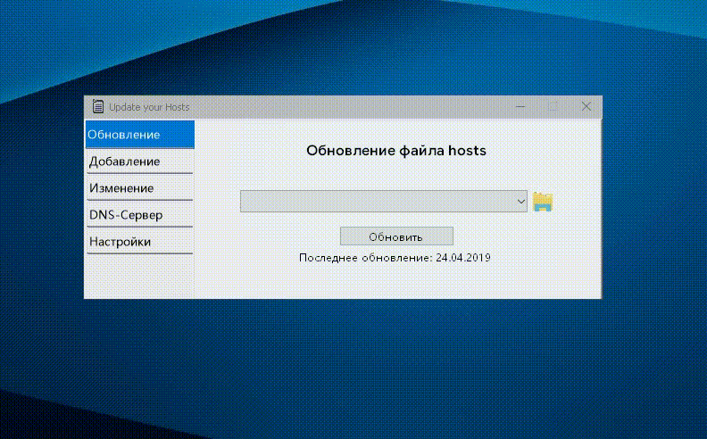

# Обновление файла Hosts 
Полезность программы заключается в:
- Большом списке фильтров (Спасибо [@StevenBlack](https://github.com/stevenblack))
- Удобном выборе фильтра 
- Возможности вручную добавлять домены в фильтр
- Возможности включить автоматическое обновление основного фильтра
- Возможности сброса фильтра на стандартное значение
- Автоматическом создании файла бэкапа фильтра перед перезаписью новым
- Возможности изменения DNS сервера

### To-do list:
- [x] Добавить выбор фильтра
- [x] Добавить возможность ручного добавления доменов
- [x] Добавить выбор DNS сервера
- [x] Добавить настройки
